# ERD

Mermaid source — renders in GitHub/VS Code. Relationship detail and invariants:
[../architecture/domain-model.md](../architecture/domain-model.md).

```mermaid
erDiagram
    ORGANIZATION ||--o{ BRANCH : has
    ORGANIZATION ||--o{ USER : employs
    ROLE ||--o{ USER : classifies
    ROLE }o--o{ PERMISSION : grants
    BRANCH ||--o{ INVENTORY : stocks
    BRANCH ||--o{ ORDER : sells
    BRANCH ||--o{ PURCHASE_ORDER : buys

    CATEGORY ||--o{ CATEGORY : parent_of
    CATEGORY ||--o{ PRODUCT : classifies
    BRAND ||--o{ PRODUCT : owns
    PRODUCT ||--o{ PRODUCT_VARIANT : has
    PRODUCT ||--o{ PRODUCT_IMAGE : shows
    CATEGORY }o--o{ ATTRIBUTE : declares
    ATTRIBUTE ||--o{ ATTRIBUTE_VALUE : allows
    PRODUCT_VARIANT ||--o{ VARIANT_ATTRIBUTE_VALUE : described_by
    ATTRIBUTE_VALUE ||--o{ VARIANT_ATTRIBUTE_VALUE : used_in

    PRODUCT_VARIANT ||--o{ INVENTORY : stocked_as
    PRODUCT_VARIANT ||--o{ INVENTORY_TRANSACTION : moves
    BRANCH ||--o{ INVENTORY_TRANSACTION : records
    STOCK_TRANSFER ||--o{ STOCK_TRANSFER_ITEM : contains
    STOCK_COUNT ||--o{ STOCK_COUNT_ITEM : contains

    SUPPLIER ||--o{ PURCHASE_ORDER : supplies
    PURCHASE_ORDER ||--o{ PURCHASE_ORDER_ITEM : contains
    PURCHASE_ORDER ||--o{ PURCHASE_RECEIPT : received_by
    PURCHASE_RECEIPT ||--o{ PURCHASE_RECEIPT_ITEM : contains
    PURCHASE_ORDER_ITEM ||--o{ PURCHASE_RECEIPT_ITEM : fulfilled_by
    SUPPLIER ||--o{ SUPPLIER_PAYMENT : paid_by

    CUSTOMER ||--o{ CUSTOMER_ADDRESS : has
    CUSTOMER ||--o{ CUSTOMER_NOTE : annotated_by
    CUSTOMER ||--o{ ORDER : places
    CUSTOMER ||--o{ CART : owns
    CUSTOMER ||--o{ WISHLIST : keeps
    USER |o--o| CUSTOMER : account_for

    CART ||--o{ CART_ITEM : contains
    PRODUCT_VARIANT ||--o{ CART_ITEM : chosen_as

    ORDER ||--o{ ORDER_ITEM : contains
    PRODUCT_VARIANT ||--o{ ORDER_ITEM : sold_as
    ORDER ||--o{ PAYMENT : paid_by
    PAYMENT ||--o{ REFUND : refunded_by
    PAYMENT ||--o{ PAYMENT_EVENT : logs
    ORDER ||--o{ ORDER_EVENT : timeline
    ORDER ||--o{ SHIPMENT : shipped_by
    SHIPMENT ||--o{ SHIPMENT_EVENT : tracks
    ORDER ||--o{ RETURN_REQUEST : returned_by
    RETURN_REQUEST ||--o{ RETURN_ITEM : contains
    ORDER_ITEM ||--o{ RETURN_ITEM : returned_as
    COUPON ||--o{ ORDER : discounts
    COUPON ||--o{ COUPON_REDEMPTION : used_in

    SHIPPING_ZONE ||--o{ SHIPPING_METHOD : offers
    SHIPPING_METHOD ||--o{ SHIPMENT : uses
    COURIER ||--o{ SHIPMENT : carries

    WISHLIST ||--o{ WISHLIST_ITEM : contains
    PRODUCT ||--o{ REVIEW : reviewed_by
    CUSTOMER ||--o{ REVIEW : writes
    USER ||--o{ AUDIT_LOG : performs
    USER ||--o{ NOTIFICATION : receives
```

## Table count by app

| App | Tables |
|---|---|
| core | `numbersequence`, `auditlog`, `setting` |
| accounts | `organization`, `branch`, `role`, `permission`, `role_permissions`, `user` |
| catalog | `category`, `brand`, `attribute`, `attributevalue`, `categoryattribute`, `product`, `productvariant`, `variantattributevalue`, `productimage` |
| inventory | `inventory`, `inventorytransaction`, `stocktransfer`, `stocktransferitem`, `stockcount`, `stockcountitem` |
| purchasing | `supplier`, `purchaseorder`, `purchaseorderitem`, `purchasereceipt`, `purchasereceiptitem`, `supplierpayment` |
| customers | `customer`, `customeraddress`, `customernote` |
| orders | `cart`, `cartitem`, `order`, `orderitem`, `orderevent`, `payment`, `paymentevent`, `refund`, `returnrequest`, `returnitem`, `heldsale` |
| shipping | `courier`, `shippingzone`, `shippingmethod`, `shipment`, `shipmentevent` |
| promotions | `coupon`, `couponredemption` |
| engagement | `wishlist`, `wishlistitem`, `review` |
| notifications | `notification` |
